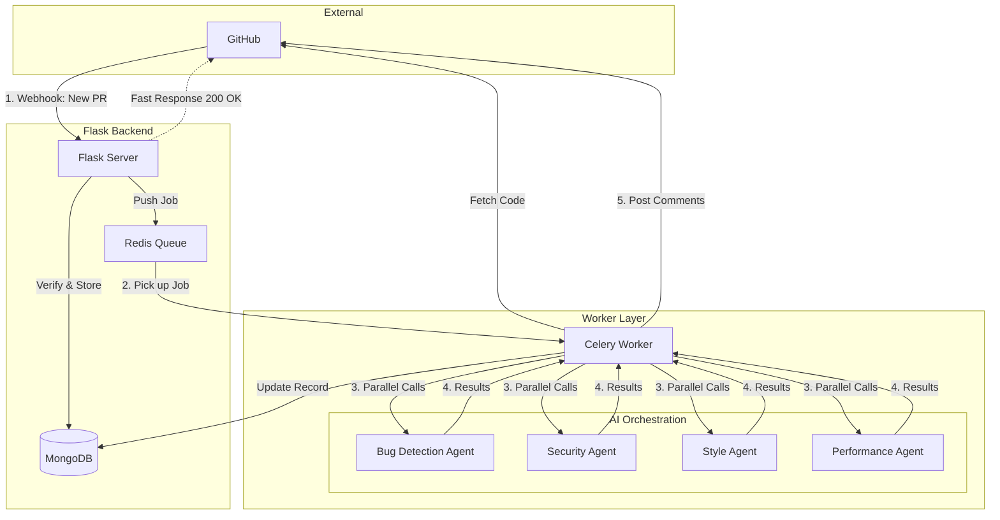

# AI Code Reviewer POC

## Objective

A system that automatically reviews code when developers create pull requests on GitHub.

## The Flow

1. Developer pushes code to GitHub and opens a pull request (PR).
2. GitHub sends us a notification (webhook).
3. Our system receives the notification.
4. AI agents examine the code looking for bugs, security issues, and style problems.
5. Our system posts comments back to the GitHub PR with findings.

